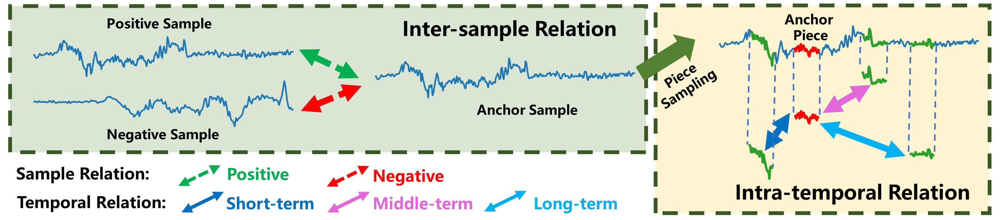
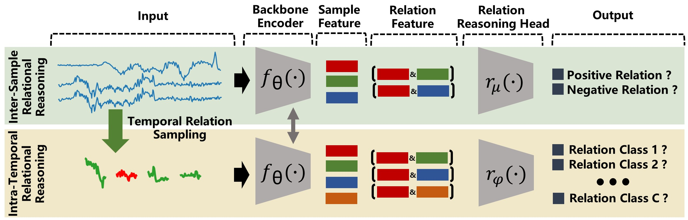

# Self-Supervised Time Series Representation Learning by Inter-Intra Relational Reasoning


This repository contains the official PyTorch implementation of:

**Self-Supervised Time Series Representation Learning by Inter-Intra Relational Reasoning.**  





**Abstract:** Self-supervised learning achieves superior performance in many domains by extracting useful representations from the unlabeled data. However, most of traditional self-supervised methods mainly focus on exploring the inter-sample structure while less efforts have been concentrated on the underlying intra-temporal structure, which is important for time series data. In this paper, we present SelfTime: a general Self-supervised Time series representation learning framework, by exploring the inter-sample relation and intra-temporal relation of time series to learn the underlying structure feature on the unlabeled time series. Specifically, we first generate the inter-sample relation by sampling positive and negative samples of a given anchor sample, and intra-temporal relation by sampling time pieces from this anchor. Then, based on the sampled relation, a shared feature extraction backbone combined with two separate relation reasoning heads are employed to quantify the relationships of the sample pairs for inter-sample relation reasoning, and the relationships of the time piece pairs for intra-temporal relation reasoning, respectively. Finally, the useful representations of time series are extracted from the backbone under the supervision of relation reasoning heads. Experimental results on multiple real-world time series datasets for time series classification task demonstrate the effectiveness of the proposed method.



## Requirements

* Python 3.6 or 3.7
* PyTorch version 1.4


## Run Model Training and Evaluation

### Self-supervised Pretraining

**InterSample**:
```bash
python train_ssl.py --dataset_name CricketX --model_name InterSample
```

**IntraTemporal**:
```bash
python train_ssl.py --dataset_name CricketX --model_name IntraTemporal
```

**SelfTime**:
```bash
python train_ssl.py --dataset_name CricketX --model_name SelfTime
```


### Linear Evaluation
**InterSample**:
```bash
python test_linear.py --dataset_name CricketX --model_name InterSample
```

**IntraTemporal**:
```bash
python test_linear.py --dataset_name CricketX --model_name IntraTemporal
```

**SelfTime**:
```bash
python test_linear.py --dataset_name CricketX --model_name SelfTime
```

### Supervised Training and Test
```bash
python train_test_supervised.py --dataset_name CricketX --model_name SupCE
```
## Check Results
After runing model training and evaluation, the checkpoints of the trained model are saved in the local [ckpt] directory, the training logs are saved in the local [log] directory, and all experimental results are saved in the local [results] directory.


<!-- ### Cite
If you make use of this code in your own work, please cite our paper.
```bash
@inproceedings{
anonymous2021selfsupervised,
title={Self-Supervised Time Series Representation Learning by Inter-Intra Relational Reasoning},
author={Haoyi Fan, Fengbin Zhang, Yue Gao},
booktitle={Submitted to International Conference on Learning Representations},
year={2021},
url={https://openreview.net/forum?id=qFQTP00Q0kp},
note={under review}
}
``` -->